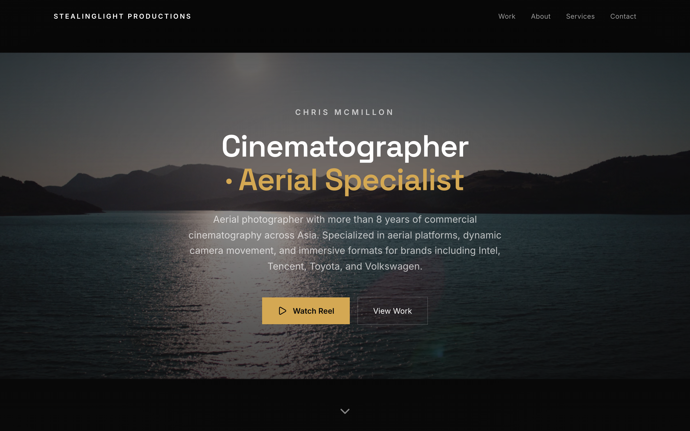
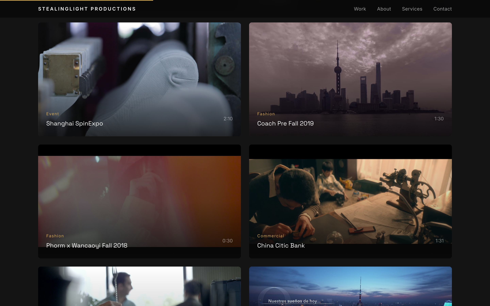
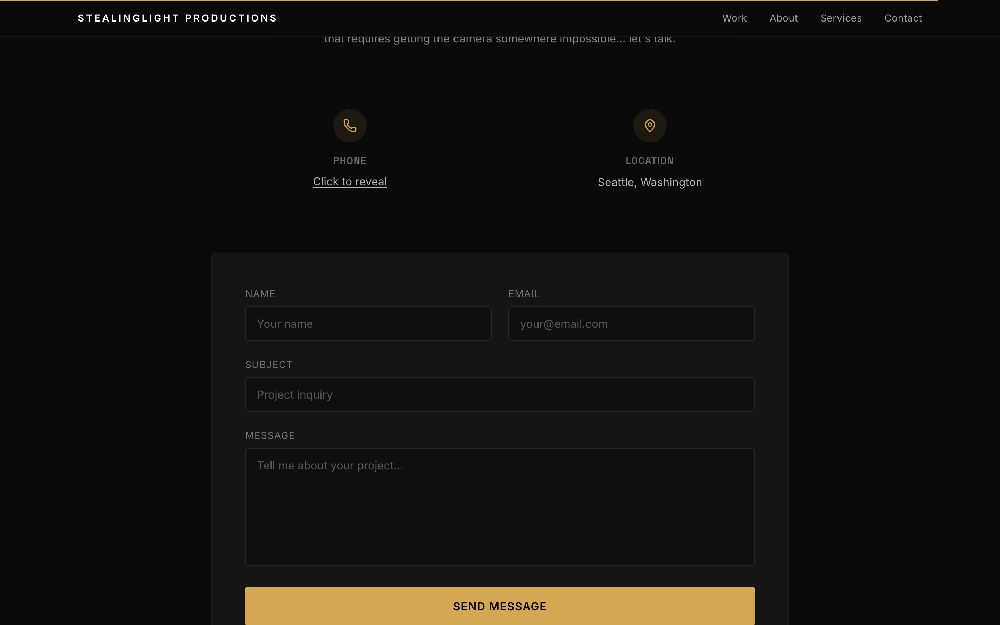
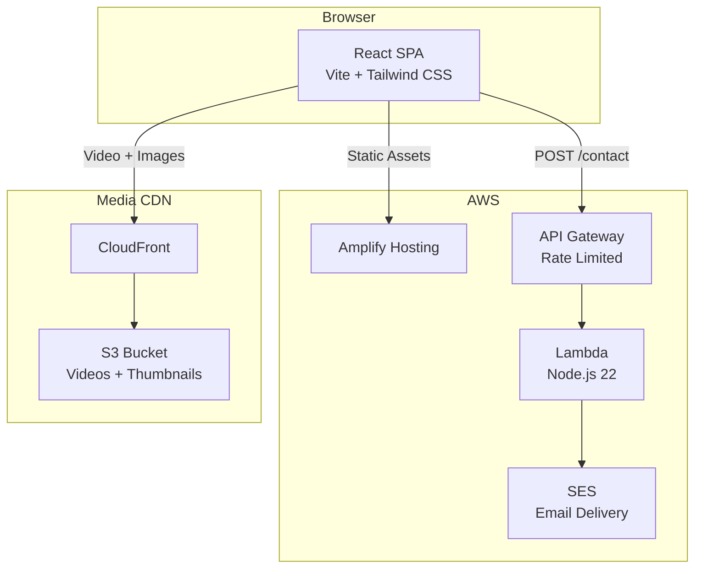

# stealinglight.hk

[](https://github.com/Stealinglight/StealinglightHK/actions/workflows/test.yml)
[](https://github.com/Stealinglight/StealinglightHK/actions/workflows/security.yml)




A cinematography portfolio website for [stealinglight.hk](https://stealinglight.hk) — a single-page React app showcasing 19 film and video projects across commercial, documentary, fashion, and short film work. Built with cinematic scroll animations, video filtering, and a serverless contact form on AWS.

## Features

### Video Portfolio



- **19 video projects** across 7 categories — Commercial, Documentary, Short Film, Fashion, Event, Personal Reel, Company Reel
- **Category filtering** with animated grid transitions
- **Cinematic video modal** with keyboard navigation (Escape to close, arrow keys between videos, spacebar play/pause)
- **Touch-friendly** — tap-to-preview on mobile devices with hover detection

### Cinematic Experience

- **Hero section** with drone footage background video and staggered text reveal animations
- **Scroll-triggered animations** on every section with coordinated entrance timing
- **Infinite-scroll client marquee** with 15 brand logos
- **Scroll progress indicator** — thin amber accent bar showing page position
- **Branded preloader** displayed while hero video buffers

### Contact



- **Serverless contact form** powered by AWS Lambda + SES
- **Cloudflare Turnstile** invisible CAPTCHA protection with server-side verification
- **Click-to-reveal phone number** to prevent scraping
- **Rate-limited API** — 10 req/sec with burst limit of 20

## Architecture



## Tech Stack

| Layer     | Technology                                                  |
| --------- | ----------------------------------------------------------- |
| Framework | React 19, TypeScript, Vite 7                                |
| Styling   | Tailwind CSS 4, custom cinematic theme                      |
| Animation | Motion (framer-motion), CSS animations                      |
| Forms     | Controlled inputs with useState, Sonner toast notifications |
| Testing   | Playwright E2E, Jest (infrastructure)                       |
| Hosting   | AWS Amplify                                                 |
| Backend   | AWS Lambda, API Gateway, SES                                |
| Media     | AWS CloudFront CDN, S3                                      |
| CI/CD     | GitHub Actions (E2E tests, security scanning)               |
| IaC       | AWS CDK (TypeScript)                                        |

## Getting Started

### Prerequisites

- [Node.js 22](https://nodejs.org/) (LTS)
- [Bun](https://bun.sh) (local development) or npm (CI-compatible)

### Installation

```bash
git clone https://github.com/Stealinglight/StealinglightHK.git
cd StealinglightHK
bun install    # or: npm install
```

### Development

```bash
bun dev        # Start dev server at http://localhost:5173
```

### Build & Preview

```bash
bun run build     # Production build
bun run preview   # Preview at http://localhost:4173
```

### Testing

```bash
bun run test      # Run Playwright E2E tests
bun run test:ui   # Interactive test UI
```

## Project Structure

```
stealinglightHK/
├── src/
│   ├── main.tsx                    # Entry point
│   ├── app/
│   │   ├── App.tsx                 # Root component (section composition)
│   │   ├── components/
│   │   │   ├── Hero.tsx            # Hero with drone video background
│   │   │   ├── Portfolio.tsx       # Video grid with category filtering
│   │   │   ├── Clients.tsx         # Infinite-scroll brand marquee
│   │   │   ├── About.tsx           # Bio section
│   │   │   ├── Services.tsx        # Services overview
│   │   │   ├── Contact.tsx         # Contact form + Turnstile
│   │   │   ├── Navigation.tsx      # Sticky nav with scroll tracking
│   │   │   ├── Footer.tsx          # Site footer
│   │   │   ├── Preloader.tsx       # Branded loading screen
│   │   │   └── ScrollProgress.tsx  # Scroll position indicator
│   │   └── config/
│   │       └── videos.ts           # Video metadata (19 projects)
│   └── styles/
│       ├── index.css               # Global styles
│       ├── tailwind.css            # Tailwind directives
│       ├── theme.css               # Cinematic color theme
│       └── fonts.css               # Self-hosted font config
├── infra/                          # AWS CDK infrastructure
│   ├── lib/                        # CDK stack definitions
│   ├── lambda/                     # Lambda function source
│   └── DEPLOYMENT.md               # Deployment guide
├── tests/                          # Playwright E2E tests
├── scripts/                        # Utility scripts
│   └── capture-screenshots.ts      # Screenshot automation
└── docs/
    └── screenshots/                # README screenshots
```

## Scripts

| Command               | Description                                   |
| --------------------- | --------------------------------------------- |
| `bun dev`             | Start development server (port 5173)          |
| `bun run build`       | Production build via Vite                     |
| `bun run preview`     | Preview production build (port 4173)          |
| `bun run lint`        | Run ESLint                                    |
| `bun run lint:fix`    | Auto-fix lint issues (zero warnings enforced) |
| `bun run test`        | Run Playwright E2E tests                      |
| `bun run test:ui`     | Interactive Playwright test UI                |
| `npm run screenshots` | Capture site screenshots for README           |

## Deployment

The site is deployed on [AWS Amplify](https://aws.amazon.com/amplify/) with GitHub integration for automatic builds on push to `main`.

Infrastructure is managed with AWS CDK. See [infra/DEPLOYMENT.md](./infra/DEPLOYMENT.md) for full deployment instructions.

## CI/CD

| Workflow                                                                                         | Trigger                  | What it does                              |
| ------------------------------------------------------------------------------------------------ | ------------------------ | ----------------------------------------- |
| [E2E Tests](https://github.com/Stealinglight/StealinglightHK/actions/workflows/test.yml)         | PR, push to main         | Playwright tests against production build |
| [Security Scan](https://github.com/Stealinglight/StealinglightHK/actions/workflows/security.yml) | PR, push to main, weekly | npm audit + CodeQL static analysis        |

## License

All rights reserved.

---

**[stealinglight.hk](https://stealinglight.hk)** — Cinematography by Chris McMillon
